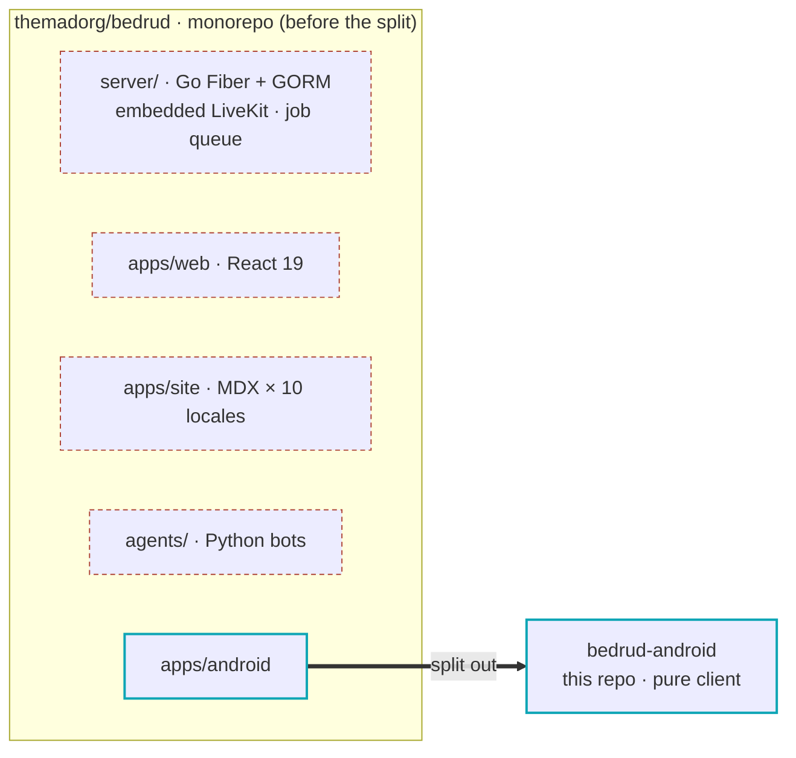
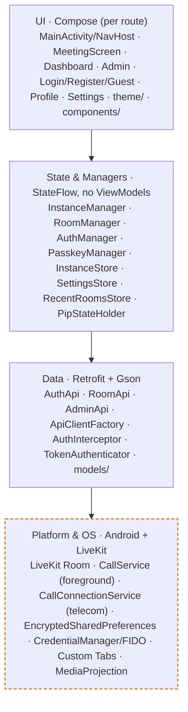
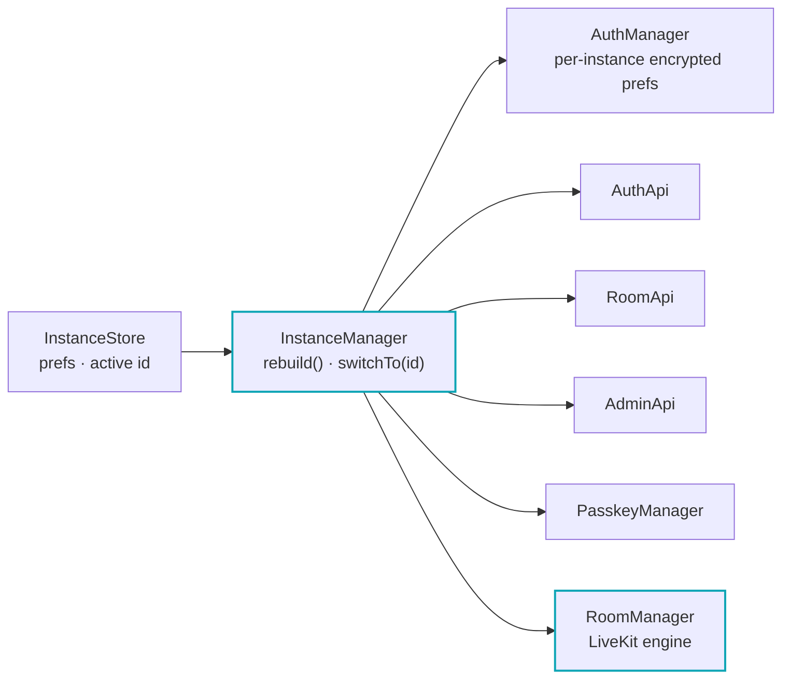
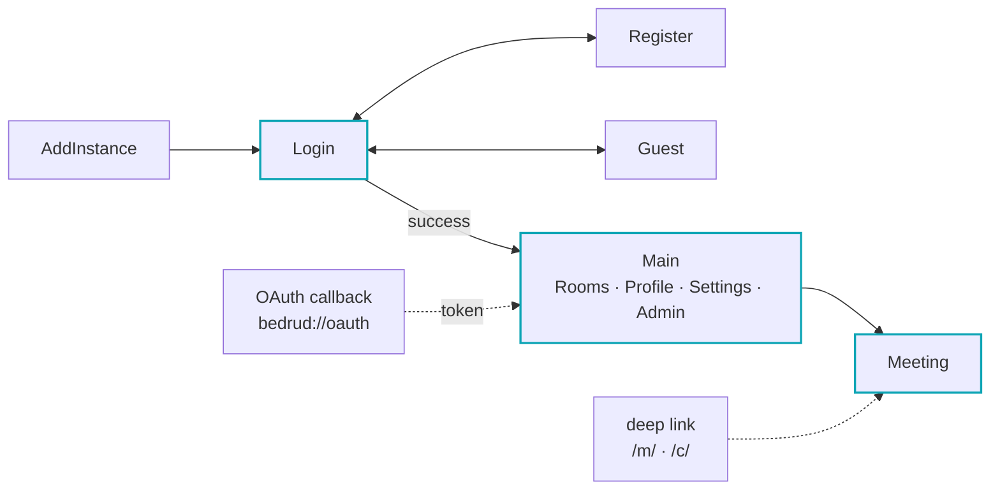
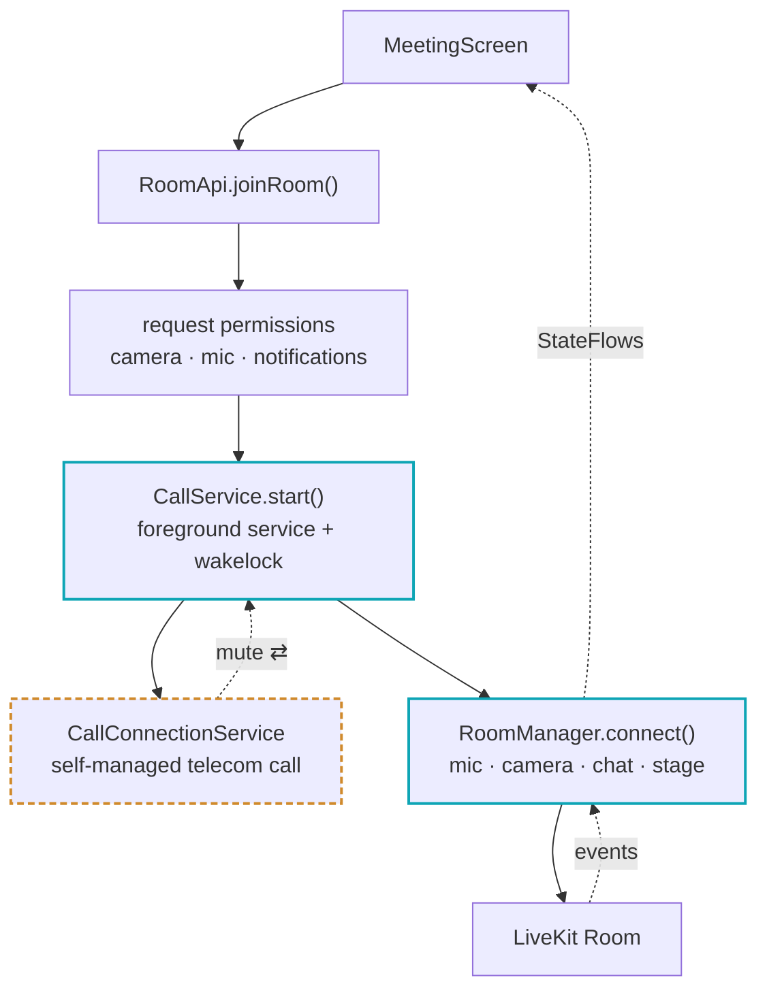
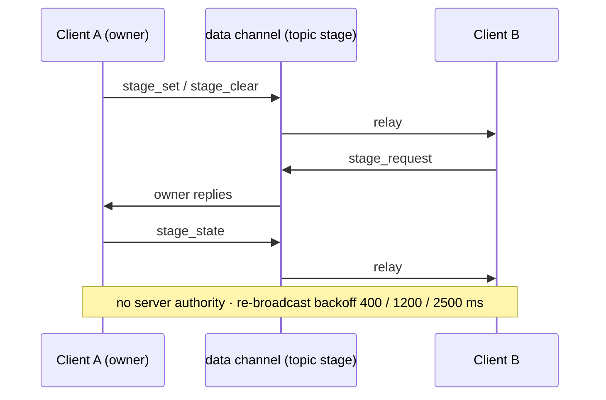
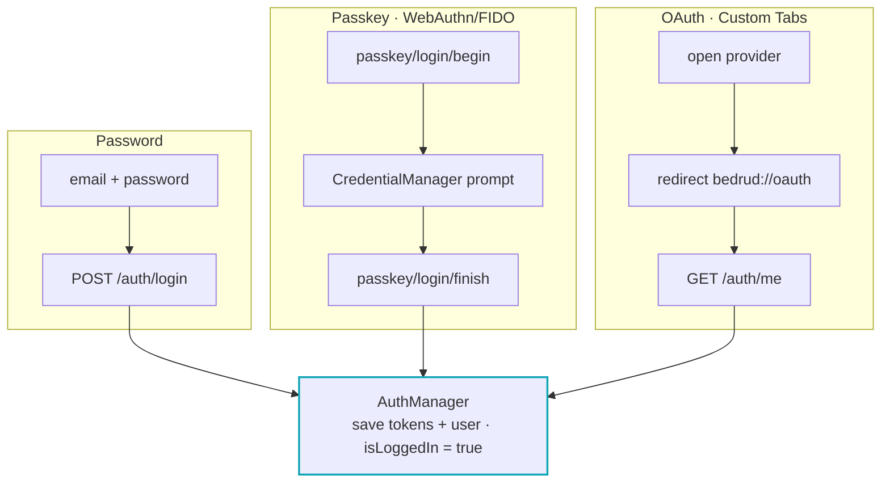

# Bedrud Android — Architecture

A wiring map of the Android client. Every box is a real code unit; every arrow is a
real dependency, call, or event. Diagrams are [Mermaid](https://mermaid.js.org) and
render natively on GitHub.

> **This repo is only the Android client.** It was split out of the `themadorg/bedrud`
> monorepo — the Go backend, React web app, docs site, and Python LiveKit agents live
> elsewhere. Nothing here runs a server; the app connects to user-added Bedrud
> **instances** over `{serverURL}/api`.

| | |
|---|---|
| **Module** | single `:app` |
| **Language / UI** | Kotlin · Jetpack Compose · Material 3 |
| **Size** | ~11.3k LOC main · ~2k LOC tests |
| **SDK** | minSdk 28 · compile/target 36 · JDK 17 |
| **DI** | Koin (`appModule`, 5 singletons) — **no ViewModels** |
| **HTTP** | Retrofit + OkHttp + **Gson** |
| **Media** | LiveKit Android 2.25 |
| **Package root** | `app/src/main/java/com/bedrud/app/` |

**How to read the diagrams:** a hub/service (orchestrator or long-lived engine) is drawn
with a **thick teal outline**; an **Android OS surface** (telecom, etc.) has a **dashed
amber outline**; **dashed arrows** are events / reverse data flow.

---

## Table of contents

1. [Where this repo came from](#0-where-this-repo-came-from)
2. [The four layers](#1-the-four-layers)
3. [The multi-instance spine](#2-the-multi-instance-spine)
4. [Navigation & entry points](#3-navigation--entry-points)
5. [Joining a meeting](#4-joining-a-meeting)
6. [The stage protocol](#5-the-stage-protocol)
7. [Authentication](#6-authentication)
8. [Where the docs and the code disagree](#7-where-the-docs-and-the-code-disagree)

---

## 0. Where this repo came from

One commit — `40374a9` "Remove everything not related to Android Project" — deleted the
rest of the product and promoted `apps/android/app` to the repo root. The 20
`.agents/skills/bedrud-*` skills still describe the whole product; treat them as a spec
for the server this client talks to.

*Dashed red = removed from this repo.* The client talks to whatever server instance you
point it at.

---

## 1. The four layers

Dependencies point downward only. The unusual part lives in the bottom layer: this app
leans on Android's **telecom** stack and **encrypted preferences** as first-class
building blocks, not just LiveKit.

State lives in `MutableStateFlow` on the manager/store classes and is read in composables
via `collectAsState()`.

---

## 2. The multi-instance spine

The whole app hangs off one hub. The user picks a server; `InstanceManager.rebuild()`
constructs a fresh, **per-instance** set of clients and exposes each as a
`StateFlow<T?>`. Calling `switchTo(id)` swaps **all of them at once**, and the UI reacts.

- Each output is exposed as `StateFlow<T?>`; screens collect them, never a raw client.
- Interceptors wrap the APIs: **`AuthInterceptor`** attaches `Bearer <token>`;
  **`TokenAuthenticator`** refreshes on `401` via a separate Retrofit (to avoid recursion),
  retries once, and forces logout on failure.
- API base URL is the computed `{serverURL}/api`. New instances are health-checked
  (`GET /api/health`) before being saved.

---

## 3. Navigation & entry points

Routing is reactive — `BedrudNavHost` redirects based on `instances.isEmpty()` and
`isLoggedIn`. Two side doors bypass the front: a shared meeting link and the OAuth
callback.

The **Admin** tab only appears when `currentUser.isAdmin` is true, and carries its own
nested Overview / Users / Rooms / Settings bottom-nav.

---

## 4. Joining a meeting

The app's most distinctive path. A meeting isn't just a LiveKit connection — it's
registered as a **self-managed Android phone call**. That's what gives it proper audio
routing, a call-style notification (mute / hang-up actions), a wakelock, and survival in
the background.

- Returning from the call notification re-enters via `ACTION_RETURN_TO_MEETING`.
- If the server removes the participant, LiveKit's `PARTICIPANT_REMOVED` disconnect
  reason drives the "you were removed" screen.
- Picture-in-picture renders a single track from the same `RoomManager` state.
- Foreground service types: `microphone | camera | phoneCall`.

---

## 5. The stage protocol

"Who is presenting?" (screen-share / whiteboard / YouTube) has **no server authority**.
Clients gossip ownership over the LiveKit data channel on topic `stage`, and late joiners
catch up by asking. `StageWire` encodes four message types; retries use staggered backoff
so state converges.

Admin moderation (kick · ban · mute · bring-to-stage) goes the other way — through
`RoomApi` to the server — so **authority and presentation are deliberately separate
concerns**.

---

## 6. Authentication

Every path ends the same way — tokens and the user land in the per-instance
`AuthManager`, and `isLoggedIn` flips. What differs is who holds the secret.

Guest login is a fourth, lighter path (name only). OAuth providers: Google · GitHub ·
Twitter/X.

---

## 7. Where the docs and the code disagree

Onboarding traps found while reading. Several docs in this repo describe the *former
monorepo*, not this app — verify against source before trusting them.

| Severity | Issue | Detail |
|---|---|---|
| **Correctness** | OAuth can't refresh | `MainActivity` saves an empty refresh token (`saveTokens(token, "")`). The first `401` after expiry finds no refresh token and forces a logout. |
| **Design drift** | `DESIGN.md` describes the web app | It prescribes "Rose + Teal, 0px radius." The Android theme is actually shadcn **slate/navy** (`#0F172A`), and components are **rounded** (8–28dp). Don't apply it here. |
| **Multi-instance** | Deep links hardwired to `bedrud.com` | The manifest's `autoVerify` intent filters only match `bedrud.com`, yet the app connects to arbitrary servers. Other instances' `/m/` links won't App-Link-verify. |
| **Stale doc** | `AGENTS.md` predates i18n | It says "no strings.xml." There are now 10 locales + RTL fonts — but the migration is **partial**: `LoginScreen` still hardcodes English. It also miscounts Koin singletons (5, not 4). |
| **Telecom** | Mute state isn't truly synced | `CallConnectionService.updateMuteState(muted)` ignores its argument and only calls `setActive()`, so the OS call's mute never reflects the real mic. |
| **Environment** | No Android SDK assumed | A checkout without `ANDROID_HOME` / `local.properties` can't run `./gradlew` tasks until an SDK is configured. |

---

*This map is a model, not a contract. The source of truth is the code under
`app/src/main/java/com/bedrud/app/`; when they disagree, the code wins.*
