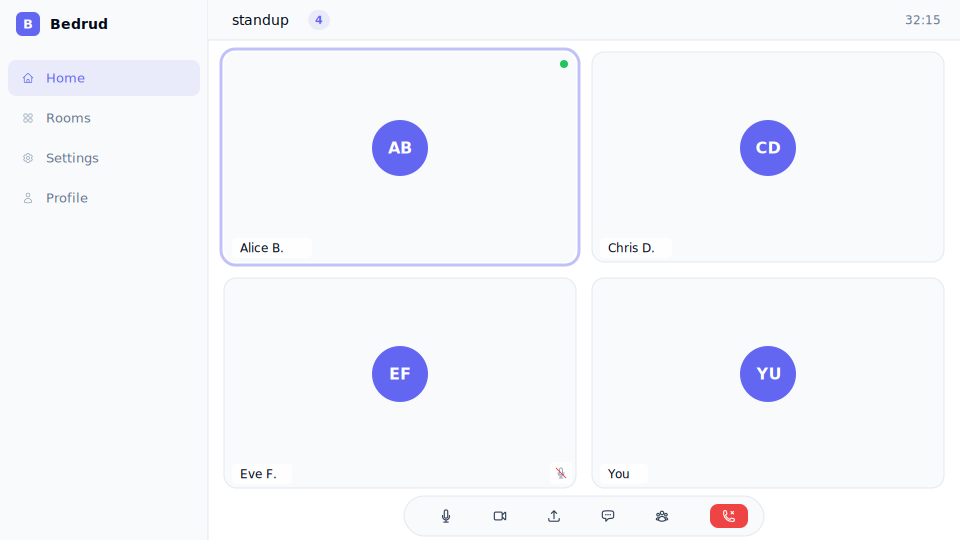
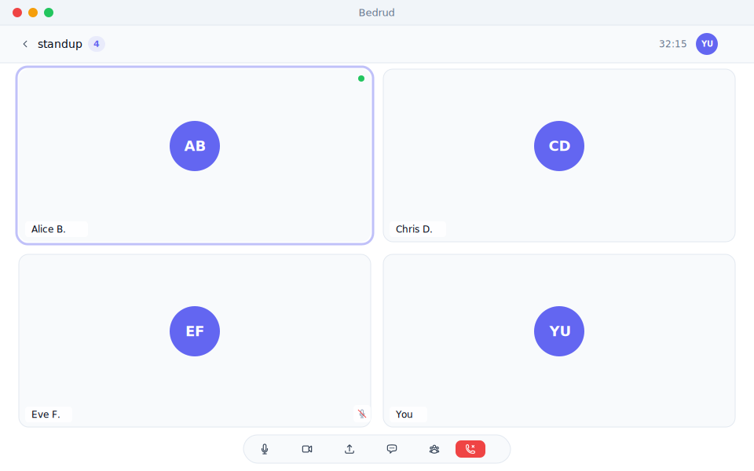
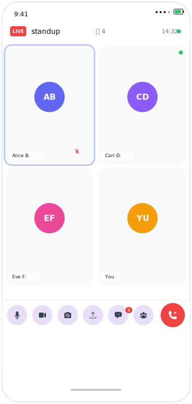
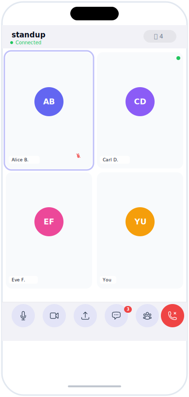
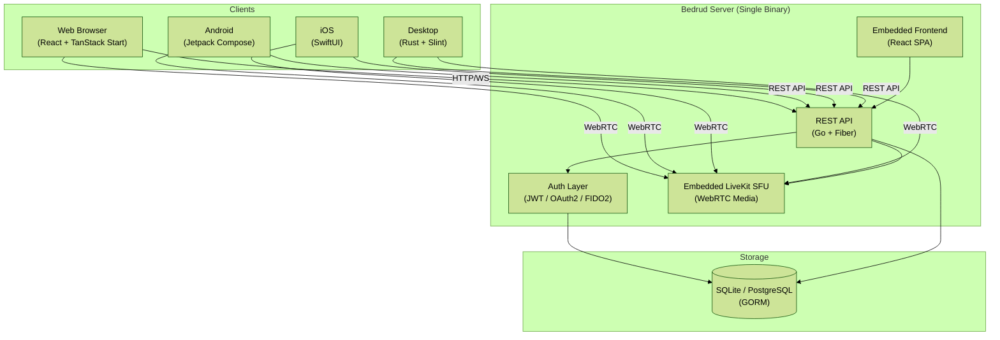

# Bedrud

**Self-hosted video meeting platform** — a single binary that packages the web UI, REST API, and WebRTC media server into one deployable unit.

[](https://github.com/themadorg/bedrud/actions/workflows/ci.yml)
[](https://github.com/themadorg/bedrud/actions/workflows/release.yml)
[](https://github.com/themadorg/bedrud/releases/latest)
[](https://github.com/themadorg/bedrud/releases/latest)
[](LICENSE)
[](https://go.dev)
[](https://github.com/themadorg/bedrud/pkgs/container/bedrud)
[](https://github.com/themadorg/bedrud/commits/main)

[](https://bedrud.org/en/docs/guides/packages/#android)
[](https://bedrud.org/en/docs/guides/packages/#ios)
[](https://bedrud.org/en/docs/guides/packages/#windows)
[](https://bedrud.org/en/docs/guides/packages/#linux)
[](https://bedrud.org/en/docs/guides/packages/#macos)

[](https://bedrud.org/en/docs/)
[](https://bedrud.org/de/docs/)
[](https://bedrud.org/fr/docs/)
[](https://bedrud.org/es/docs/)
[](https://bedrud.org/zh/docs/)
[](https://bedrud.org/ja/docs/)
[](https://bedrud.org/tr/docs/)
[](https://bedrud.org/fa/docs/)
[](https://bedrud.org/ar/docs/)
[](https://bedrud.org/ru/docs/)

---

Deploying self-hosted video infrastructure typically requires managing multiple services, external media servers, and separate client applications. Bedrud solves this by packaging the web UI, REST API, and a WebRTC media server into a single, lightweight binary, giving privacy-conscious teams complete control without the DevOps headache.

## Why Bedrud?

|                         | Bedrud                           | Jitsi Meet                               | BigBlueButton                                 |
|-------------------------|----------------------------------|------------------------------------------|-----------------------------------------------|
| **Deployment**          | Single binary, no dependencies   | Multiple services (Jicofo, JVB, Prosody) | Heavy stack (Tomcat, Redis, FreeSWITCH, etc.) |
| **Media server**        | Embedded LiveKit SFU             | External Jitsi Videobridge               | External FreeSWITCH                           |
| **Native clients**      | Android, iOS, Desktop (Rust)     | Web only (Electron wrapper)              | Web only                                      |
| **Mobile multi-server** | Connect to multiple instances    | Single server                            | Single server                                 |
| **Built-in installer**  | `bedrud install` (systemd + TLS) | Manual setup                             | Manual setup                                  |
| **Resource usage**      | ~200 MB RAM*                     | ~1 GB+ RAM*                              | ~2 GB+ RAM*                                   |

*\*Approximate, varies by load and configuration.*

Designed for privacy-first teams who want full control without managing complex infrastructure.

---

## Quick Start

Run with Docker:

```bash
docker run -p 8090:8090 -p 7880:7880 ghcr.io/themadorg/bedrud:latest
```

Open `http://localhost:8090`, create an account, and start a meeting.

> Demo coming soon.

---

## Table of Contents

- [Screenshots](#screenshots)
- [Features](#features)
- [Installation](#installation)
- [Configuration](#configuration)
- [Security](#security)
- [Troubleshooting](#troubleshooting)
- [Architecture](#architecture)
- [Documentation](#documentation)
- [Development Setup](#development-setup)
- [Client Apps](#client-apps)
- [Bot Agents](#bot-agents)
- [Tech Stack](#tech-stack)
- [Makefile Reference](#makefile-reference)
- [Project Status](#project-status)
- [Roadmap](#roadmap)
- [Support](#support)
- [Contributing](#contributing)
- [License](#license)

---

## Screenshots

### Web UI

<picture>
  <source media="(prefers-color-scheme: dark)" srcset="docs/images/web-dark.svg">
  <source media="(prefers-color-scheme: light)" srcset="docs/images/web-light.svg">
  
</picture>

*Web meeting room with video grid, chat sidebar, and controls.*

### Desktop App (Windows / Linux / macOS)

<picture>
  <source media="(prefers-color-scheme: dark)" srcset="docs/images/desktop-dark.svg">
  <source media="(prefers-color-scheme: light)" srcset="docs/images/desktop-light.svg">
  
</picture>

*Native desktop client with picture-in-picture and system integration.*

### Android

<picture>
  <source media="(prefers-color-scheme: dark)" srcset="docs/images/android-dark.svg">
  <source media="(prefers-color-scheme: light)" srcset="docs/images/android-light.svg">
  
</picture>

*Android meeting view with material design and gesture controls.*

### iOS

<picture>
  <source media="(prefers-color-scheme: dark)" srcset="docs/images/ios-dark.svg">
  <source media="(prefers-color-scheme: light)" srcset="docs/images/ios-light.svg">
  
</picture>

*iOS meeting interface with SwiftUI and native iOS integration.*

---

## Features

- **Video & Audio Meetings** — WebRTC-powered rooms via an embedded LiveKit media server
- **Single Binary** — Go server with the React frontend and LiveKit compiled in; no runtime dependencies
- **Native Client Apps** — Android (Jetpack Compose), iOS (SwiftUI), and desktop (Rust + Slint for Windows, Linux, and macOS) with picture-in-picture, deep linking, and call management
- **Multiple Auth Methods** — Email/password, OAuth (Google, GitHub, Twitter), guest access, and FIDO2 passkeys
- **Room Controls** — Public/private rooms, admin kick/mute/video-off, participant management
- **Multi-Instance** — Mobile and desktop apps can connect to multiple Bedrud servers simultaneously
- **Bot Agents** — Python agents for streaming music, radio, and video into rooms
- **Built-in Installer** — `bedrud install` sets up systemd services, TLS certificates, and configuration on Debian/Ubuntu
- **Docker Support** — Multi-variant images (Debian, Alpine, Distroless) on GHCR for containerized deployments

---

## Installation

### Docker (Recommended)

```bash
# Debian-based (default)
docker pull ghcr.io/themadorg/bedrud:latest
docker run -p 8090:8090 -p 7880:7880 ghcr.io/themadorg/bedrud:latest

# Alpine-based (smaller image)
docker pull ghcr.io/themadorg/bedrud:latest-alpine
docker run -p 8090:8090 -p 7880:7880 ghcr.io/themadorg/bedrud:latest-alpine

# Distroless (smallest, no shell)
docker pull ghcr.io/themadorg/bedrud:latest-distroless
docker run -p 8090:8090 -p 7880:7880 ghcr.io/themadorg/bedrud:latest-distroless
```

Open `http://localhost:8090`, create an account, and start a meeting.

Three image variants are available:

| Tag                  | Base            | Size   | Use when                               |
|----------------------|-----------------|--------|----------------------------------------|
| `:latest`            | Debian Bookworm | ~50 MB | Default — compatible with most systems |
| `:latest-alpine`     | Alpine 3.21     | ~30 MB | Alpine hosts, minimal footprint        |
| `:latest-distroless` | Distroless      | ~25 MB | Smallest attack surface, no shell      |

All images contain the same static binary — the base image only affects runtime utilities (ca-certs, timezone data).

> [!TIP]
> Ports `8090` (web UI + API) and `7880` (WebRTC media) must both be exposed. For production, use a reverse proxy (Traefik, Caddy, nginx) with TLS on port 8090.

#### Ports

| Port        | Protocol | Purpose                           |
|-------------|----------|-----------------------------------|
| 8090        | TCP      | Web UI, REST API, WebSocket       |
| 7880        | TCP      | LiveKit signaling                 |
| 50000–60000 | UDP      | WebRTC media (configurable range) |
| 3478        | UDP      | TURN relay                        |
| 5349        | TCP      | TURN/TLS relay                    |

<details>
<summary>Build Docker image from source</summary>

```bash
docker build -t bedrud .
docker run -p 8090:8090 -p 7880:7880 bedrud
```

</details>

### Binary Download

<details>
<summary>Linux (x86_64 / ARM64)</summary>

```bash
curl -L https://github.com/themadorg/bedrud/releases/latest/download/bedrud_linux_amd64.tar.xz | tar xJ
sudo mv bedrud /usr/local/bin/
sudo bedrud install   # sets up systemd, TLS, and config
```

For ARM64 (Raspberry Pi, ARM servers): replace `amd64` with `arm64`.

</details>

<details>
<summary>Windows</summary>

Download `bedrud_windows_amd64.zip` from the [latest release](https://github.com/themadorg/bedrud/releases/latest).

</details>

See [latest release](https://github.com/themadorg/bedrud/releases/latest) for all platforms.

### Ubuntu/Debian (APT)

<details>
<summary>Install via apt repository</summary>

```bash
curl -fsSL https://themadorg.github.io/bedrud/bedrud.gpg.key \
  | sudo gpg --dearmor -o /etc/apt/trusted.gpg.d/bedrud.gpg
echo "deb https://themadorg.github.io/bedrud stable main" \
  | sudo tee /etc/apt/sources.list.d/bedrud.list
sudo apt update && sudo apt install bedrud
sudo bedrud install
```

</details>

### Arch Linux (AUR)

<details>
<summary>Install from AUR</summary>

```bash
yay -S bedrud-bin
sudo bedrud install
```

</details>

### Alpine Linux (.apk)

<details>
<summary>Install Alpine package</summary>

```bash
wget https://github.com/themadorg/bedrud/releases/latest/download/bedrud_x86_64.apk
apk add --allow-untrusted bedrud_x86_64.apk
```

For ARM64: replace `x86_64` with `aarch64`.

</details>

### Desktop Client

<details>
<summary>Ubuntu/Debian (apt)</summary>

```bash
# After adding the repo above:
sudo apt install bedrud-desktop
```

</details>

<details>
<summary>Arch Linux (AUR)</summary>

```bash
yay -S bedrud-desktop-bin
```

</details>

<details>
<summary>AppImage (any Linux)</summary>

```bash
wget https://github.com/themadorg/bedrud/releases/latest/download/bedrud-desktop-linux-x86_64.AppImage
chmod +x bedrud-desktop-linux-x86_64.AppImage
./bedrud-desktop-linux-x86_64.AppImage
```

</details>

<details>
<summary>macOS (unsigned)</summary>

```bash
# Apple Silicon
curl -L https://github.com/themadorg/bedrud/releases/latest/download/bedrud-desktop-macos-arm64.tar.gz | tar xz
# Intel
curl -L https://github.com/themadorg/bedrud/releases/latest/download/bedrud-desktop-macos-x86_64.tar.gz | tar xz
```

> [!WARNING]
> macOS builds are unsigned. Gatekeeper will block the app on first launch. To bypass: `xattr -d com.apple.quarantine bedrud-desktop` or allow it in **System Settings → Privacy & Security**.

</details>

<details>
<summary>Windows</summary>

Download the NSIS installer or portable `.zip` from the [latest release](https://github.com/themadorg/bedrud/releases/latest) for x86_64 or ARM64.

</details>

See the [Package Installation guide](https://bedrud.org/en/docs/guides/packages/) for full details on all platforms.

---

## Configuration

**Development:** `server/config.yaml` (auto-generated by `make init` from `config.local.yaml`)
**Production:** `/etc/bedrud/config.yaml` (set up by `bedrud install`)

Override path: `CONFIG_PATH=/path/to/config.yaml bedrud run`

Minimum production changes:

```yaml
auth:
  jwtSecret: "change-to-random-string-32-chars"
  sessionSecret: "change-to-another-random-string"
```

See the [Configuration guide](https://bedrud.org/en/docs/getting-started/configuration/) for the full reference, LiveKit settings, environment variables, and production checklist.

---

## Security

- **Change default secrets** — `jwtSecret` and `sessionSecret` must be set to strong random values in production
- **TLS is required** — use `bedrud install` (Let's Encrypt), a reverse proxy, or set `server.enableTLS: true`
- **Firewall** — open only the ports listed above; restrict LiveKit UDP range to your needs

See the [Production Checklist](https://bedrud.org/en/docs/getting-started/configuration/#production-checklist) for a complete list.

---

## Troubleshooting

| Issue                   | Cause                   | Fix                                                                                                                           |
|-------------------------|-------------------------|-------------------------------------------------------------------------------------------------------------------------------|
| No video/audio          | UDP ports blocked       | Open port range 50000–60000 (or your configured `rtc.port_range_start`–`port_range_end`)                                      |
| Media works on LAN only | Missing external IP     | Set `rtc.use_external_ip: true` and configure your public IP in LiveKit config                                                |
| TURN not connecting     | TLS certificate missing | TURN/TLS (port 5349) needs a valid certificate. See [TURN Server Guide](https://bedrud.org/en/docs/architecture/turn-server/) |
| CORS errors in browser  | Mismatched origins      | Set `cors.allowedOrigins` to your frontend URL                                                                                |

For more, see [WebRTC Connectivity](https://bedrud.org/en/docs/architecture/webrtc-connectivity/) and [TURN Server](https://bedrud.org/en/docs/architecture/turn-server/).

---

## Architecture



### Project Structure

```
bedrud/
├── server/          Go backend (Fiber, GORM, embedded LiveKit)
├── apps/
│   ├── web/         React frontend (TanStack Start, TailwindCSS v4)
│   ├── android/     Jetpack Compose app (Koin, Retrofit, LiveKit SDK)
│   ├── ios/         SwiftUI app (KeychainAccess, LiveKit SDK)
│   └── desktop/     Native desktop app (Rust, Slint, LiveKit SDK)
├── agents/          Python bots (music, radio, video stream)
├── packages/        Shared TypeScript types (@bedrud/api-types)
├── tools/cli/       Deployment CLI (pyinfra, Click)
├── Cargo.toml       Rust workspace root
└── docs/images/       Platform screenshots (SVG)
```

See the [Architecture Overview](https://bedrud.org/en/docs/architecture/overview/) for detailed documentation.

---

## Documentation

Full documentation: [bedrud.org/en/docs](https://bedrud.org/en/docs/)

Key pages:
- [Quick Start](https://bedrud.org/en/docs/getting-started/quickstart/)
- [Architecture Overview](https://bedrud.org/en/docs/architecture/overview/)
- [Deployment Guide](https://bedrud.org/en/docs/guides/deployment/)
- [API Reference](https://bedrud.org/en/docs/api/authentication/)

---

## Development Setup

### Prerequisites

- **Go** 1.24+
- **Bun** (JavaScript runtime / package manager)
- **LiveKit Server** (for local development)

### Commands

```bash
git clone https://github.com/themadorg/bedrud.git
cd bedrud
make init     # install all dependencies
make dev      # start LiveKit + server + web frontend
```

The web frontend runs at `http://localhost:3000` and the API at `http://localhost:8090`.

> See [AGENTS.md](AGENTS.md) for the full developer guide including build order, testing, and common gotchas.

> [!NOTE]
> API docs available at `http://localhost:8090/api/swagger` (Swagger UI) or `http://localhost:8090/api/scalar` (Scalar UI) when the server is running.

> For detailed platform-specific development setup, see the [Development Workflow](https://bedrud.org/en/docs/guides/development/) guide.

### Production Build

```bash
make build            # Build frontend + backend into a single binary
make build-dist       # Build compressed linux/amd64 tarball (static)
```

---

## Client Apps

| Client  | Platform                | Stack                                | Download                                                                |
|---------|-------------------------|--------------------------------------|-------------------------------------------------------------------------|
| Web     | Browser                 | React 19, TanStack Start             | N/A (runs on server)                                                    |
| Android | API 28+                 | Kotlin, Jetpack Compose, LiveKit SDK | [APK / Play Store](https://bedrud.org/en/docs/guides/packages/#android) |
| iOS     | 18.0+                   | Swift, SwiftUI, LiveKit SDK          | [IPA / App Store](https://bedrud.org/en/docs/guides/packages/#ios)      |
| Desktop | Windows / Linux / macOS | Rust, Slint, LiveKit SDK             | [Installers](https://bedrud.org/en/docs/guides/packages/#desktop)       |

> [!NOTE]
> Building client apps from source? See [Development Setup](#development-setup) and [Contributing Guide](https://bedrud.org/en/docs/contributing/) for platform-specific commands.

---

## Bot Agents

Stream media into meeting rooms using Python agents:

```bash
cd agents/music_agent
python -m venv .venv
source .venv/bin/activate  # On Windows: .venv\Scripts\activate
pip install -r requirements.txt
python agent.py "https://meet.example.com/m/room-name"
```

Available agents: `music_agent`, `radio_agent`, `video_stream_agent`.

---

## Tech Stack

Go + Fiber backend · React 19 frontend · LiveKit WebRTC SFU · Android / iOS / Desktop native clients

<details>
<summary>View full technology stack</summary>

| Layer        | Technology                                                      |
|--------------|-----------------------------------------------------------------|
| Backend      | Go 1.24, Fiber, GORM, LiveKit Protocol SDK                      |
| Web Frontend | React 19, TanStack Start, TanStack Router, TailwindCSS v4, Vite |
| Android      | Kotlin, Jetpack Compose, Koin, Retrofit, LiveKit Android SDK    |
| iOS          | Swift, SwiftUI, KeychainAccess, LiveKit Swift SDK               |
| Desktop      | Rust, Slint, reqwest, LiveKit Rust SDK                          |
| Auth         | JWT, OAuth2 (Goth), WebAuthn / FIDO2 Passkeys                   |
| Database     | SQLite (default), PostgreSQL (production)                       |
| Media        | LiveKit (embedded WebRTC SFU)                                   |
| CI/CD        | GitHub Actions, Docker, GHCR                                    |
| Deployment   | pyinfra, systemd, Traefik                                       |

</details>

---

## Makefile Reference

<details>
<summary>View all Makefile targets</summary>

| Command                    | Description                                       |
|----------------------------|---------------------------------------------------|
| `make help`                | Show all available targets                        |
| `make init`                | Install all dependencies                          |
| `make dev`                 | Run LiveKit + server + web concurrently           |
| `make build`               | Build frontend + backend (embedded single binary) |
| `make build-dist`          | Build production linux/amd64 tarball (static)     |
| `make build-android-debug` | Build Android debug APK                           |
| `make build-android`       | Build Android release APK                         |
| `make build-ios`           | Build iOS archive                                 |
| `make build-ios-sim`       | Build for iOS simulator                           |
| `make build-desktop`       | Build desktop release binary                      |
| `make dev-desktop`         | Run desktop app (debug)                           |
| `make test-back`           | Run server tests                                  |
| `make deploy ARGS=...`     | Run deployment CLI                                |
| `make clean`               | Remove build artifacts                            |

For the full target list, see the [Makefile Reference](https://bedrud.org/en/docs/guides/makefile/) or run `make help`.

</details>

---

## Project Status

Bedrud is in **active development**. Core features are functional and used in production. Breaking API changes are possible before v1.0; minor versions may include non-breaking additions.

---

## Roadmap

- [ ] Screen sharing with annotation tools
- [ ] End-to-end encryption (E2EE) for peer-to-peer rooms
- [ ] Recording and playback (server-side + participant local)
- [ ] Breakout rooms
- [ ] SIP/VoIP gateway for dial-in access
- [ ] LDAP / SAML / OIDC enterprise authentication
- [ ] Whiteboard collaboration (shared canvas)
- [ ] Signed and notarized macOS / Windows builds

See [GitHub Issues](https://github.com/themadorg/bedrud/issues) and [Discussions](https://github.com/themadorg/bedrud/discussions) for the latest plans.

---

## Support

- **Bug Reports & Feature Requests:** [GitHub Issues](https://github.com/themadorg/bedrud/issues)
- **Architecture Discussions & Questions:** [GitHub Discussions](https://github.com/themadorg/bedrud/discussions)
- **Documentation:** [bedrud.org/en/docs](https://bedrud.org/en/docs/)

> [!NOTE]
> Before reporting issues, please check existing issues and documentation to avoid duplicates.

---

## Contributing

Contributions are welcome! Please open an issue first for significant changes.

See [CONTRIBUTING.md](CONTRIBUTING.md) and the online [Contributing Guide](https://bedrud.org/en/docs/contributing/) for:
- Development setup instructions
- Code style conventions
- Pull request process
- CI/CD checks

---

## License

[Apache-2.0](LICENSE)

By contributing to Bedrud, you agree that your contributions will be licensed under the Apache License 2.0.
