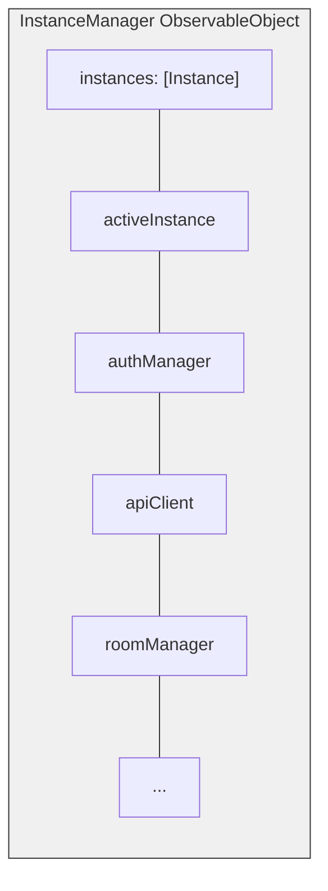

The Bedrud iOS app is built with SwiftUI, providing a native video meeting experience with multi-instance support and secure credential storage.

## Technology Stack

| Technology | Version | Purpose |
|-----------|---------|---------|
| Swift | 5.9+ | Language |
| SwiftUI | Latest | UI framework |
| LiveKit Swift SDK | 2.0+ | WebRTC media |
| KeychainAccess | 4.2.2+ | Secure credential storage |

**Deployment target:** iOS 18.0

## Project Configuration

The project uses **XCodeGen** for project generation from `project.yml`:

- Bundle ID: `com.bedrud.ios`
- Generated with: `xcodegen generate`

## Directory Structure

```text
apps/ios/Bedrud/
├── BedrudApp.swift                # App entry point
├── Core/
│   ├── API/
│   │   └── APIClient.swift        # URLSession-based REST client
│   ├── Auth/
│   │   └── AuthManager.swift      # Token management, login/logout
│   ├── Instance/
│   │   ├── InstanceManager.swift  # Central multi-instance orchestrator
│   │   └── InstanceStore.swift    # Persistent instance storage (UserDefaults)
│   └── LiveKit/
│       └── RoomManager.swift      # LiveKit room connection manager
├── Features/
│   ├── Auth/
│   │   ├── LoginView.swift        # Login screen
│   │   └── RegisterView.swift     # Registration screen
│   ├── Dashboard/
│   │   └── DashboardView.swift    # Room list and management
│   ├── Meeting/
│   │   └── MeetingView.swift      # Video call interface
│   ├── Profile/
│   │   └── ProfileView.swift      # User profile
│   ├── Instance/
│   │   ├── AddInstanceView.swift  # Add server instance
│   │   └── InstanceSwitcherView.swift  # Switch between instances
│   ├── Settings/
│   │   └── SettingsView.swift     # App settings
│   ├── JoinByURL/
│   │   └── JoinByURLView.swift    # Deep link handling
│   └── Main/
│       └── MainTabView.swift      # Tab navigation
├── Models/
│   ├── User.swift
│   ├── Room.swift
│   └── Instance.swift
└── Design/
    └── Components/                # Reusable SwiftUI components
```

## Multi-Instance Architecture

The iOS app mirrors the Android architecture for multi-instance support.



### Key Pattern

Dependencies are `@Published` properties on `InstanceManager`, which is an `ObservableObject`. Views receive it via `@EnvironmentObject`:

```swift
struct DashboardView: View {
    @EnvironmentObject var instanceManager: InstanceManager

    var body: some View {
        if let authManager = instanceManager.authManager {
            // Render authenticated UI
        }
    }
}
```

### Navigation Flow

```mermaid
flowchart LR
    NoInstances["No instances"] */} AddInstanceView
    HasInstancesNotLogged["Has instances,<br>not logged in"] */} LoginView
    HasInstancesLogged["Has instances,<br>logged in"] */} DashboardView
    DashboardView -. "toolbar sheet" .-> InstanceSwitcherView["InstanceSwitcherView"]
```

The instance switcher appears as a `.sheet` triggered from the Dashboard toolbar.

## App Entry Point

`BedrudApp.swift` initializes the core services and injects them into the SwiftUI environment:

```swift
@main
struct BedrudApp: App {
    @StateObject var instanceStore = InstanceStore()
    @StateObject var instanceManager = InstanceManager()
    @StateObject var settingsStore = SettingsStore()

    var body: some Scene {
        WindowGroup {
            ContentView()
                .environmentObject(instanceStore)
                .environmentObject(instanceManager)
                .environmentObject(settingsStore)
        }
    }
}
```

## Features

### Secure Storage

Uses **KeychainAccess** for storing JWT tokens and sensitive credentials, rather than UserDefaults.

### Deep Linking

Handles URLs for direct room joining and room codes.

### Settings

User preferences are persisted via `SettingsStore` using UserDefaults.

## Building

```bash
# Open in Xcode
make dev-ios

# Build archive (Release)
make build-ios

# Export IPA (requires ExportOptions.plist)
make export-ios

# Build for simulator (Debug)
make build-ios-sim
```

### Requirements

- Xcode (latest stable)
- iOS 18.0 deployment target
- For device builds: Apple Developer account and provisioning profile
