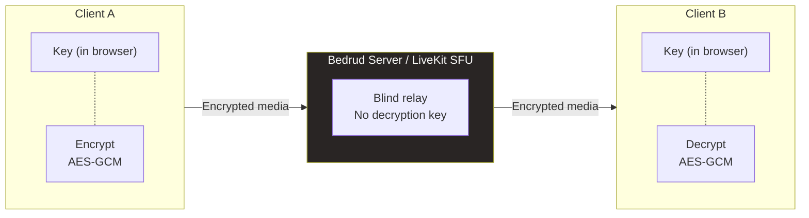
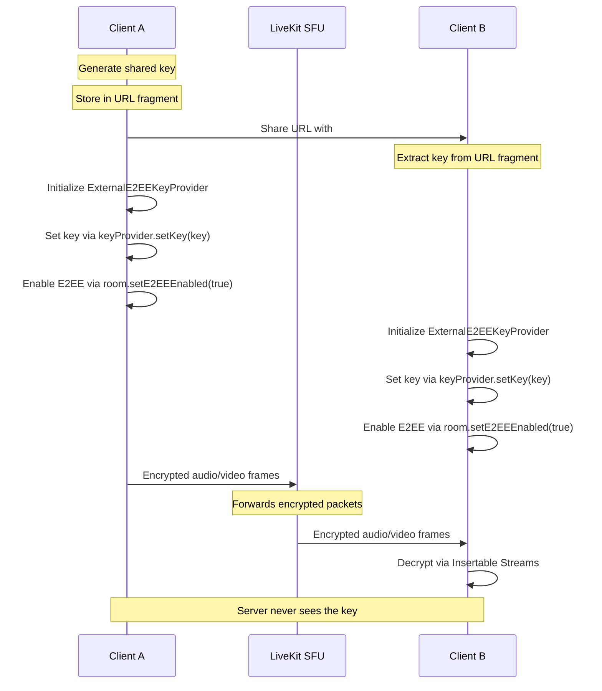

> [!NOTE]
> Yüksek düzeyli bir özet mi yoksa etkileşimli bir WebRTC paket akış demosu mu arıyorsunuz? [Uçtan Uca Şifreleme Tanıtım Sayfamıza](/tr/e2ee) göz atın.

Bedrud supports per-room End-to-End Encryption (E2EE) as an optional setting. This page documents both the current implementation — a room-level boolean that controls metadata and UI — and the planned architecture for full client-side media encryption using the WebRTC Insertable Streams API and LiveKit E2EE SDK.

---

## Overview

E2EE follows a **zero-knowledge architecture**:

- **Encryption keys are never sent to the server.** Keys are generated and managed exclusively on clients.
- **The server relays encrypted media.** The LiveKit SFU forwards encrypted packets without being able to decrypt them.
- **Only participants can decrypt.** Each participant holds the shared key.



---

## Current State

E2EE is currently a **metadata-only feature**. The room-level `e2ee` boolean setting is stored in the database, toggled via UI, and displayed as badges — but actual client-side media encryption is not yet wired up.

### Backend: Room Setting Flag

#### Database Model

The `RoomSettings` struct is embedded in the `Room` GORM model:

```go
// server/internal/models/room.go
type RoomSettings struct {
    AllowChat          bool `json:"allowChat"`
    AllowVideo         bool `json:"allowVideo"`
    AllowAudio         bool `json:"allowAudio"`
    RequireApproval    bool `json:"requireApproval"`
    E2EE               bool `json:"e2ee" gorm:"not null;default:false"`
    IsPersistent       bool `json:"isPersistent"`
    RecordingsAllowed  bool `json:"recordingsAllowed"`
}
```

Stored as the `settings_e2_ee` column in the database. Default: `false`.

#### API Endpoints

| Method | Path | Role | Description |
|--------|------|------|-------------|
| `POST` | `/api/room/create` | Authenticated | Accepts `settings.e2ee` on room creation |
| `POST` | `/api/room/join` | Authenticated | Returns `settings.e2ee` to joining client |
| `PUT` | `/api/room/:roomId/settings` | Room owner | Toggles E2EE on existing room |
| `PUT` | `/api/admin/rooms/:roomId` | Superadmin | Admin override for E2EE toggle |

The join response includes the `e2ee` setting so the client knows whether to activate encryption on the WebRTC connection. **No encryption key material is included in any API response.**

#### What the Backend Does NOT Do

- No encryption key generation or storage
- No key exchange
- No cryptographic operations
- No LiveKit E2EE server-side configuration
- No E2EE-related claims in LiveKit JWT tokens

### Frontend: UI Toggles & Badges

The `e2ee` boolean appears in the UI across all platforms:

#### Web (React)

| Component | Behavior |
|-----------|----------|
| **Create Room Dialog** | Feature chip with `ShieldCheck` icon, labeled "E2E" |
| **Room Settings Dialog** | Toggle chip in settings editor |
| **Room Card** | Displays "Encrypted" badge with `ShieldCheck` icon when enabled |
| **Admin Room Detail** | Green/red status dot for E2EE |

```tsx
// CreateRoomDialog.tsx — feature toggle chip
const features = [
  { key: 'e2ee', icon: ShieldCheck, label: 'E2E' },
  // ...
]
```

```tsx
// RoomCard.tsx — conditional badge
{room.settings.e2ee && (
  <Badge className="gap-1">
    <ShieldCheck className="h-3 w-3" />
    Encrypted
  </Badge>
)}
```

#### Android (Kotlin)

- `RoomSettings` data class with `val e2ee: Boolean = false`
- Feature pill with shield icon on dashboard
- Toggle in room settings dialog

#### iOS (Swift)

- `RoomSettings` struct with `let e2ee: Bool`
- `Label("E2EE", systemImage: "lock.shield.fill")` on room cards
- Toggle in dashboard create/edit room

#### Desktop (Rust)

- `RoomSettings` struct with `pub e2ee: bool` (serde camelCase)
- Full model support, UI toggle pending

### What the Frontend Does NOT Do

- No `ExternalE2EEKeyProvider` or `BaseKeyProvider` from LiveKit SDK
- No `RTCRtpSender.transform` / `RTCRtpReceiver.transform` (Insertable Streams)
- No Web Worker for crypto
- No URL hash key parsing
- No `setE2EEEnabled()` call on the LiveKit `Room` object

---

## Planned Architecture

The following describes the intended full E2EE implementation once client-side LiveKit E2EE SDK integration is complete.

### Data Flow



### Key Generation & Distribution

Keys are generated **locally in the browser** and distributed **out-of-band** — typically via the URL fragment (`#key=...`), which is never sent to the server:

```typescript
// Generating a key and embedding it in the URL
const key = crypto.getRandomValues(new Uint8Array(32));
const base64Key = btoa(String.fromCharCode(...key));
const url = `https://meet.example.com/room/abc123#key=${base64Key}`;
```

The URL fragment is:
- Available to JavaScript via `window.location.hash`
- **Never sent in HTTP requests** to the server
- Visible to the participant who shares the URL
- Not persisted by the server

### LiveKit E2EE SDK Integration (Planned)

```typescript
// Planned LiveKit E2EE initialization
import { Room } from 'livekit-client';
import { ExternalE2EEKeyProvider } from 'livekit-client/e2ee';

const keyProvider = new ExternalE2EEKeyProvider();

const room = new Room({
  encryption: {
    keyProvider,
    worker: new Worker(
      new URL('livekit-client/e2ee-worker', import.meta.url)
    ),
  },
});

// Set shared key (distributed via URL fragment)
await keyProvider.setKey(sharedKey);

// Enable encryption for all local tracks
await room.setE2EEEnabled(true);

// Connect to LiveKit room
await room.connect(wsUrl, token);
```

### Encryption Details

| Property | Value |
|----------|-------|
| **Algorithm** | AES-GCM |
| **Key size** | 128-bit (default) or 256-bit |
| **Frame-level** | Each WebRTC frame encrypted individually |
| **Processing** | Web Worker (background thread) |
| **Key exchange** | Out-of-band (URL fragment, QR code, etc.) |

The encryption operates at the **RTP frame level** via the WebRTC Insertable Streams API (`RTCRtpSender.transform` and `RTCRtpReceiver.transform`). The LiveKit SDK wraps this into the `E2EEManager` abstraction that handles frame transformation automatically.

### Server Role in Planned Architecture

The server remains **zero-knowledge**:

- **No access to encryption keys**
- **No frame decryption** — LiveKit SFU forwards encrypted packets without inspection
- **No recording** of decrypted media when E2EE is enabled
- **No key management** — all key operations are client-side

### Platform Support (Planned)

| Platform | LiveKit E2EE SDK | Status |
|----------|-----------------|--------|
| Web | `ExternalE2EEKeyProvider` | Planned |
| iOS | `BaseKeyProvider` | Planned |
| Android | `BaseKeyProvider` | Planned |
| Desktop | LiveKit Rust SDK `E2EEOptions` | Planned |
| Bot agents | `@livekit/agents` E2EE options | Planned |

---

## Code Locations

### Backend

| File | Line | Purpose |
|------|------|---------|
| `server/internal/models/room.go` | 101 | `E2EE bool` field in `RoomSettings` |
| `server/internal/repository/room_repository.go` | 90, 394 | DB persistence on create/update |
| `server/internal/handlers/room.go` | 54, 1979-1980 | Admin update merge-patch logic |
| `server/internal/handlers/room.go` | 277-281 | Create room response includes settings |
| `server/internal/handlers/room.go` | 387-392 | Join room response includes settings |
| `server/internal/roomcli/roomcli.go` | 87 | CLI inspector display |
| `server/internal/server/server.go` | 371-372, 392, 445 | Route registration |

### Frontend (Web)

| File | Purpose |
|------|---------|
| `packages/api-types/src/index.ts` | Shared TS type: `e2ee: boolean` on `RoomSettings` |
| `apps/web/src/components/dashboard/CreateRoomDialog.tsx` | E2EE toggle in create form |
| `apps/web/src/components/dashboard/RoomSettingsDialog.tsx` | E2EE toggle in settings editor |
| `apps/web/src/components/dashboard/RoomCard.tsx` | "Encrypted" badge display |
| `apps/web/src/routes/dashboard/admin/rooms_.$roomId.tsx` | Admin status indicator |
| `apps/web/src/types/admin.ts` | Admin room type definition |

### Other Platforms

| Platform | File |
|----------|------|
| Android | `apps/android/app/src/main/java/com/bedrud/app/models/Room.kt` |
| iOS | `apps/ios/Bedrud/Models/Room.swift` |
| Desktop | `apps/desktop/src/api/rooms.rs` |

---

## Roadmap

E2EE is listed as an unchecked item in the project README roadmap:

> `- [ ] End-to-end encryption (E2EE) for peer-to-peer rooms`

The current milestone for client-side E2EE implementation includes:
1. Integrate LiveKit `ExternalE2EEKeyProvider` in the web meeting room
2. Implement URL fragment key distribution
3. Add E2EE status indicator in the meeting UI
4. Implement key generation UI (copy, share, QR code)
5. Platform parity: iOS `BaseKeyProvider`, Android `BaseKeyProvider`, Desktop E2EE options
6. Bot agent E2EE support

---

## See Also

- [WebRTC Connectivity](/en/docs/architecture/webrtc-connectivity) — ICE, STUN, TURN, and media routing
- [TURN Server Guide](/en/docs/architecture/turn-server) — TURN relay configuration
- [LiveKit Integration](/en/docs/backend/livekit) — how Bedrud embeds LiveKit
- [Architecture Overview](/en/docs/architecture/overview) — full system architecture
